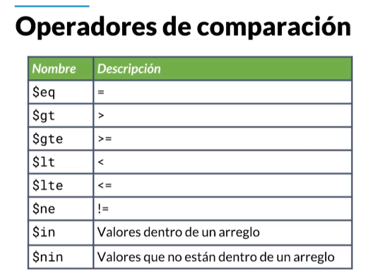
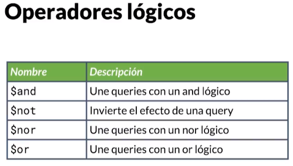
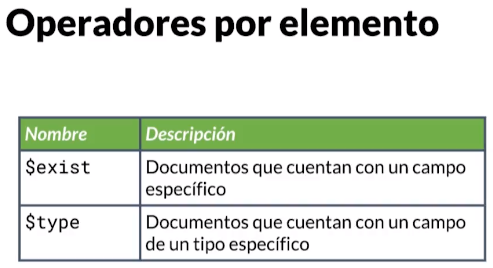
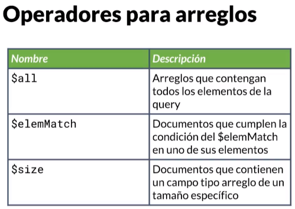

Sample for creating CRUD
use of routes

home: /api/sales/

#### 0 -> index.js in root
-> it's the creation of server with express. The begining of API  

##### middlewares
* errorHandler : for catching errors in console and exponsing them in API
  * @hapi/joi -> for validating data
  
* validaDataHandler : used for validating schemas data. Such as products, users, accounts, etc 
  * @hapi/boom : for better code status validation handler

#### 1 -> router: (controllers)
  * know how to read: [req.params, req.query, req.body]  
  * send those params, query and body to [services](#services)
  * must use middleware for reading json
  get: / ?product=''    ->  req.query
  get: /:id             ->  req.params
  post: /
  delete: /:id
  put: /id

#### 2 -> services:
  * business logic
  * it's the core of my application
  * receive params and query. Knows how to work with data
  * able to call other services and call external lib (for DB.  ie)

#### 3 -> libs / mongoDB: NoSQL
     
     
     
     
  * cluster: -it's the server 
  * database: the same
  * collections: similar to tables

